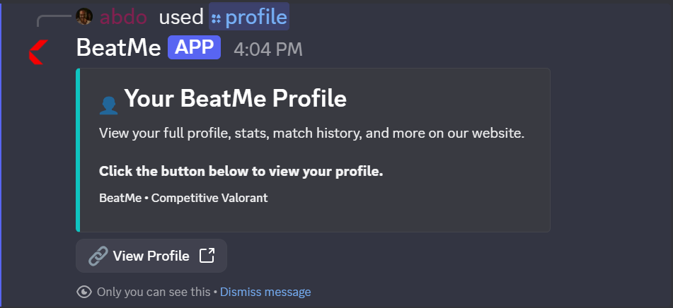
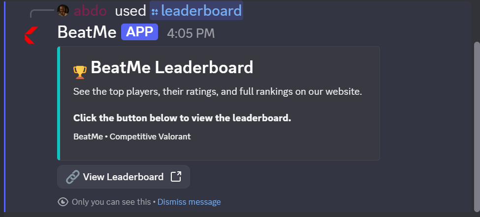

<div align="center">

#  BeatMe — Discord Bot

**Competitive matchmaking, Elo engine & refereeing system**

[](https://discord.js.org/)
[](https://www.typescriptlang.org/)
[](https://nodejs.org/)
[](https://www.prisma.io/)

</div>

---

## Overview

The BeatMe bot is the **matchmaking engine** for your Discord community. It handles:

- **Challenges** via `/play @user`
- **Accept/decline** with interactive buttons
- **Auto-created match channels** (private, per-match)
- **Referee-only** winner declaration
- **Elo rating** calculations with dynamic K-factor
- **Anti-cheat** rules (rate limits, cooldowns, restrictions)
- **Persistent storage** in PostgreSQL via Prisma

---

## Screenshots

### `/play` — Challenge a Player


The challenger selects an opponent. The bot validates:
- Both players are registered on the website
- Both have linked their Valorant account
- Anti-cheat rules are respected

---

### Auto-Created Match Channel


Upon acceptance, a **private channel** is created:
- Visible to both players + referees only
- Contains match details and referee buttons
- Auto-deleted 1 hour after completion

---

### Referee Declares Winner


Only members with the **`BeatMe Referee`** role can press the winner buttons. The bot:
- Calculates new Elo ratings
- Updates the database
- Announces the result in `#matches`

---

### `/profile` & `/leaderboard`

<table>
  <tr>
    <td width="50%">
      
      <p align="center"><b>/profile — redirects to website</b></p>
    </td>
    <td width="50%">
      
      <p align="center"><b>/leaderboard — redirects to website</b></p>
    </td>
  </tr>
</table>

Both commands redirect users to the website to drive traffic and keep Discord lightweight.

---

## Commands

### `/play opponent:@user`

Challenge another registered player to a 1v1 match.

**Validations:**
- Challenger must be registered & have Valorant linked
- Opponent must be registered & have Valorant linked
- Cannot challenge yourself or bots
- Cannot exceed 3 sent challenges per hour
- Cannot exceed 10 received challenges per hour
- Cannot play the same opponent more than 2 times per day
- No pending/active match with the same opponent

**Flow:**
1. Bot creates a `pending` match in DB
2. Posts challenge embed in `#matches`
3. Waits up to **5 minutes** for acceptance

---

### `/profile`

Displays an embed with a **button linking to your BeatMe profile page** on the website.

If you're not registered, it shows a **Register** button instead.

---

### `/leaderboard`

Displays an embed with a **button linking to the global leaderboard** on the website.

---

## Elo Rating System

BeatMe uses a **dynamic K-factor** approach inspired by FIDE chess ratings, adapted for a growing community:

<table>
    <thead>
        <tr>
            <th>Stage</th>
            <th>Matches Played</th>
            <th>K-Factor</th>
            <th>Min Δ</th>
            <th>Max Δ</th>
        </tr>
    </thead>
    <tbody>
        <tr>
            <td>🟢 <strong>Placement</strong></td>
            <td>0–9</td>
            <td>48</td>
            <td>±5</td>
            <td>±60</td>
        </tr>
        <tr>
            <td>🟡 <strong>Calibration</strong></td>
            <td>10–29</td>
            <td>32</td>
            <td>±5</td>
            <td>±40</td>
        </tr>
        <tr>
            <td>🔴 <strong>Established</strong></td>
            <td>30+</td>
            <td>20</td>
            <td>±5</td>
            <td>±25</td>
        </tr>
    </tbody>
</table>

### Why?

- **New players** need fast rating adjustments to find their true skill level
- **Veterans** have stable, trustworthy ratings
- **Underdog wins** are rewarded heavily (encourages challenges against stronger opponents)
- **Ratings never drop below 0**

### Formula
```
Expected = 1 / (1 + 10^((OpponentRating - YourRating) / 400))
Points = K × (1 - Expected)
Result = clamp(Points, MinChange, MaxChange)
```

---

## Anti-Cheat Rules

<table>
    <thead>
        <tr>
            <th>Rule</th>
            <th>Limit</th>
        </tr>
    </thead>
    <tbody>
        <tr>
            <td>Challenges sent per hour</td>
            <td><strong>3</strong></td>
        </tr>
        <tr>
            <td>Challenges received per hour</td>
            <td><strong>10</strong></td>
        </tr>
        <tr>
            <td>Matches vs same opponent per day</td>
            <td><strong>2</strong></td>
        </tr>
        <tr>
            <td>Cooldown after decline</td>
            <td><strong>1 hour</strong></td>
        </tr>
        <tr>
            <td>Challenge expiry time</td>
            <td><strong>5 minutes</strong></td>
        </tr>
    </tbody>
</table>

These rules are centralized in `src/services/anti-cheat.ts` and easy to customize.

---

## Tech Stack

<table>
    <thead>
        <tr>
            <th>Category</th>
            <th>Technologies</th>
        </tr>
    </thead>
    <tbody>
        <tr>
            <td><strong>Runtime</strong></td>
            <td>Node.js 22</td>
        </tr>
        <tr>
            <td><strong>Language</strong></td>
            <td>TypeScript 5.6</td>
        </tr>
        <tr>
            <td><strong>Discord</strong></td>
            <td>Discord.js v14</td>
        </tr>
        <tr>
            <td><strong>Database</strong></td>
            <td>PostgreSQL (Neon), Prisma ORM 6</td>
        </tr>
        <tr>
            <td><strong>Dev Tools</strong></td>
            <td>tsx (dev runner), TypeScript strict mode</td>
        </tr>
    </tbody>
</table>

---

## Getting Started

### Prerequisites

- Node.js v18+
- A Discord bot ([create one](https://discord.com/developers/applications))
- The **same database** as the website (shared Prisma schema)

### 1. Create a Discord application

1. Go to [Discord Developer Portal](https://discord.com/developers/applications)
2. Click **New Application**
3. Go to **Bot** → **Reset Token** → copy the token
4. Enable **Server Members Intent**

### 2. Invite the bot to your server

In **OAuth2 → URL Generator**, select:
- **Scopes:** `bot`, `applications.commands`
- **Permissions:** `Manage Channels`, `Manage Roles`, `Send Messages`, `Embed Links`, `Read Message History`

Copy the generated URL and open it in your browser.

### 3. Set up the server

Create:

- **Role:** `BeatMe Referee` (color of your choice)
- **Channel:** `#matches` (text channel for challenges)

Note their IDs (enable Developer Mode: Settings → Advanced → Developer Mode).

### 4. Install dependencies

```
npm install
```
5. Configure environment variables
Create a .env file:
```
env
DISCORD_TOKEN="your_bot_token"
DISCORD_APPLICATION_ID="your_app_id"
DISCORD_GUILD_ID="your_server_id"
DISCORD_REFEREE_ROLE_ID="referee_role_id"
DISCORD_MATCHES_CHANNEL_ID="matches_channel_id"

DATABASE_URL="same_as_frontend"
WEBSITE_URL="http://localhost:3000"
NODE_ENV="development"
```
6. Set up Prisma
```
npx prisma generate
```
Note: The bot shares the same schema.prisma as the frontend. Keep them in sync when making schema changes.

7. Register slash commands
```
npm run deploy
```
8. Start the bot
```
npm run dev
```
The bot should come online. Try /play @someone in your Discord server.

Project Structure
```
BeatMe-Bot/
├── src/
│   ├── commands/                    # Slash commands
│   │   ├── play.ts                  # /play
│   │   ├── profile.ts               # /profile
│   │   └── leaderboard.ts           # /leaderboard
│   ├── interactions/                # Button handlers
│   │   └── match-buttons.ts         # Accept/Decline/Winner
│   ├── services/                    # Business logic
│   │   ├── elo.ts                   # Elo calculations
│   │   ├── anti-cheat.ts            # Rules engine
│   │   └── match-service.ts         # Match lifecycle
│   ├── ui/                          # Embed builders
│   │   └── embeds.ts
│   ├── lib/
│   │   └── prisma.ts                # Prisma singleton
│   ├── config.ts                    # Env validation
│   ├── deploy-commands.ts           # Register commands
│   └── index.ts                     # Entry point
├── prisma/
│   └── schema.prisma
├── .env
├── package.json
└── tsconfig.json
```
Match Lifecycle
```
┌──────────────────┐
│  /play @user     │  Player A challenges Player B
└────────┬─────────┘
         │
         ▼
┌──────────────────┐
│  status: pending │  Challenge posted in #matches
└────────┬─────────┘
         │
    ┌────┴────┐
    │         │
    ▼         ▼
┌────────┐ ┌──────────┐
│Accept  │ │Decline   │
└───┬────┘ └────┬─────┘
    │           │
    ▼           ▼
┌────────┐ ┌──────────┐
│ active │ │cancelled │
└───┬────┘ └──────────┘
    │
    ▼
┌──────────────────┐
│  Match channel   │  Private channel created
│  + referee btns  │
└────────┬─────────┘
         │
         ▼ (referee presses winner)
┌──────────────────┐
│  status: done    │  Elo updated, result announced
│  + Elo updated   │  Channel deleted after 1 hour
└──────────────────┘
```
Deployment
Recommended: Fly.io (free tier)

# Install flyctl
fly auth signup
fly launch
fly secrets set DISCORD_TOKEN=... DISCORD_APPLICATION_ID=... ...
fly deploy
Alternative: Railway, Render, or a VPS.

Note: The bot requires 24/7 uptime to receive Discord events — Vercel/serverless will not work.

🔒 Security
Bot token stored in .env, never committed

Commands restricted to registered users only

Referee actions require Discord role check

Database transactions prevent rating race conditions

Input validation on all user-provided Riot IDs

License
No open-source license is specified in this README.

<div align="center">
Made with ❤️ for competitive Valorant communities

</div>
