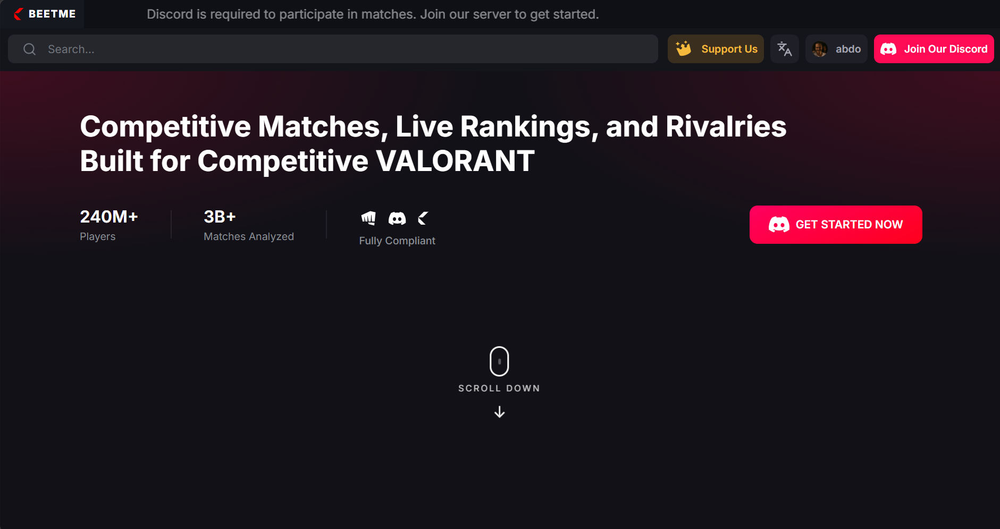
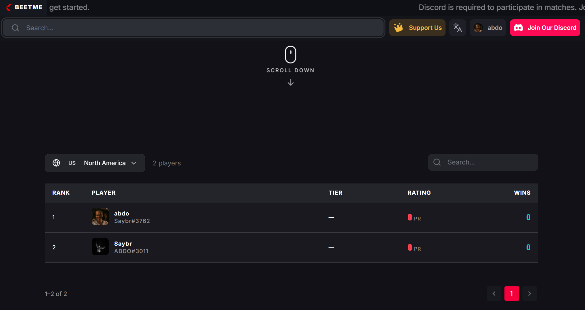
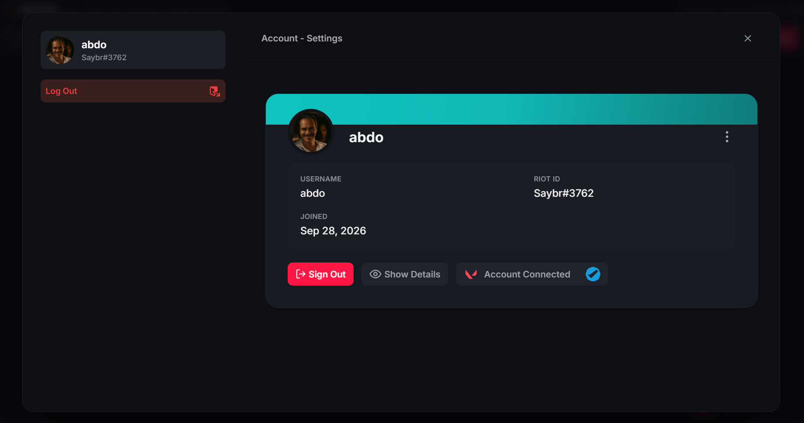
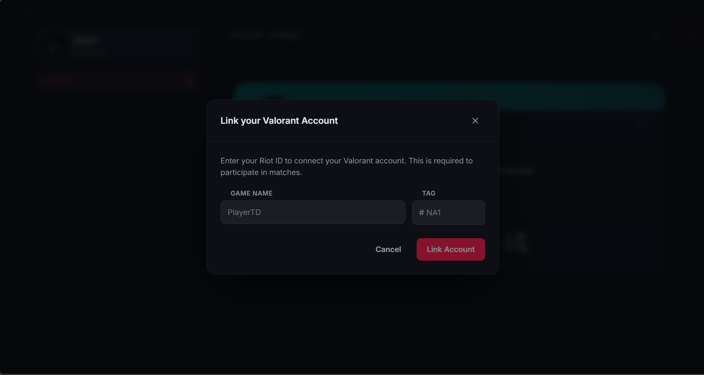
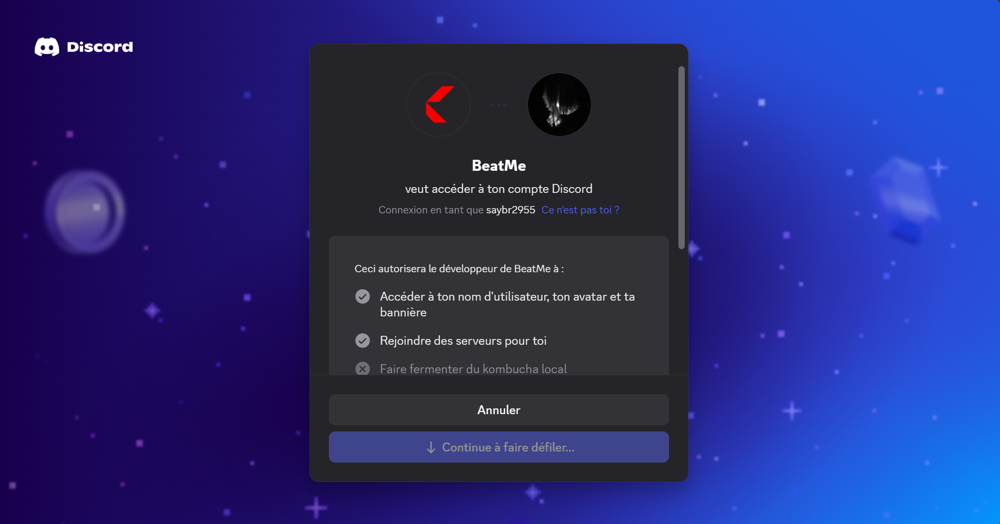
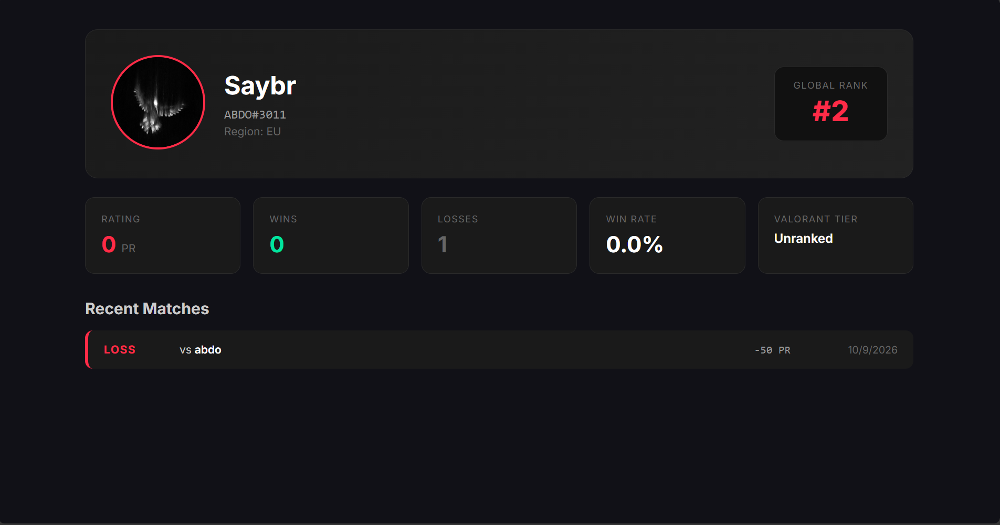
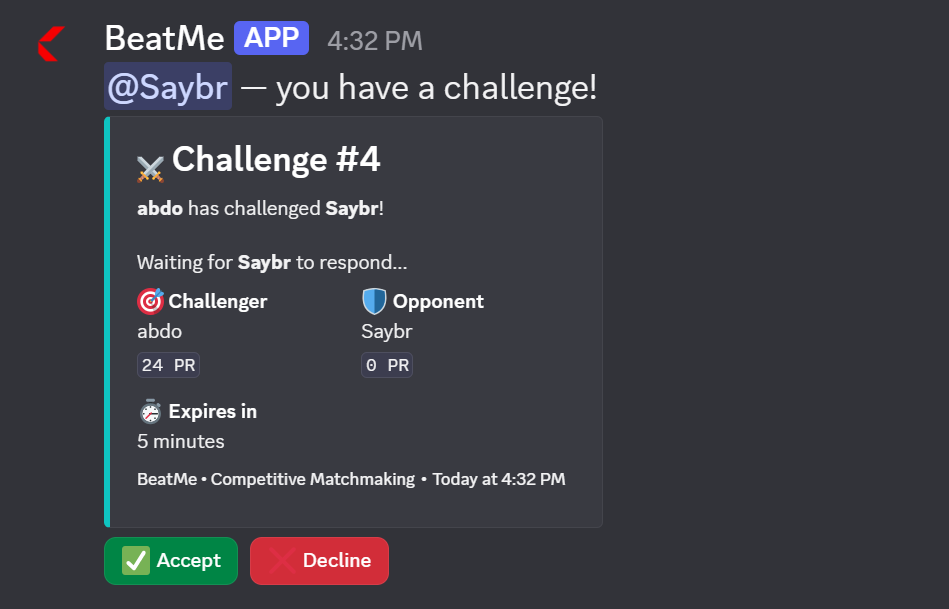
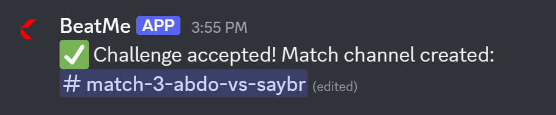
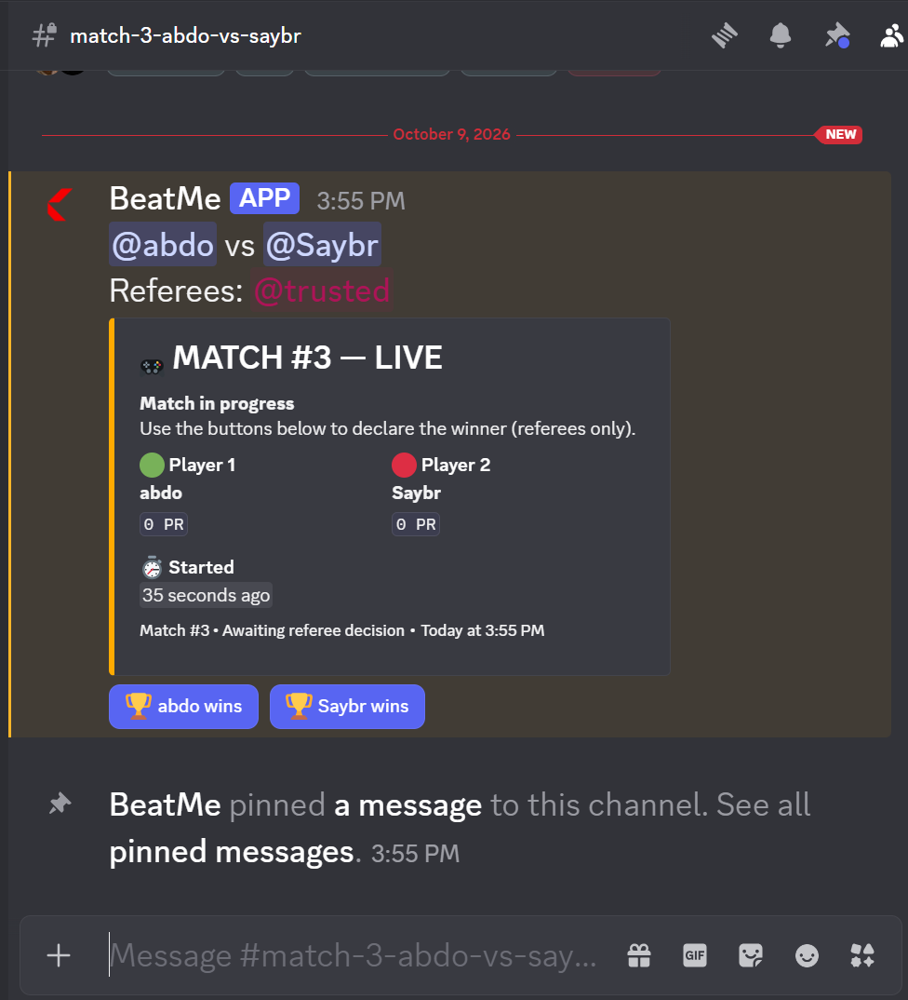
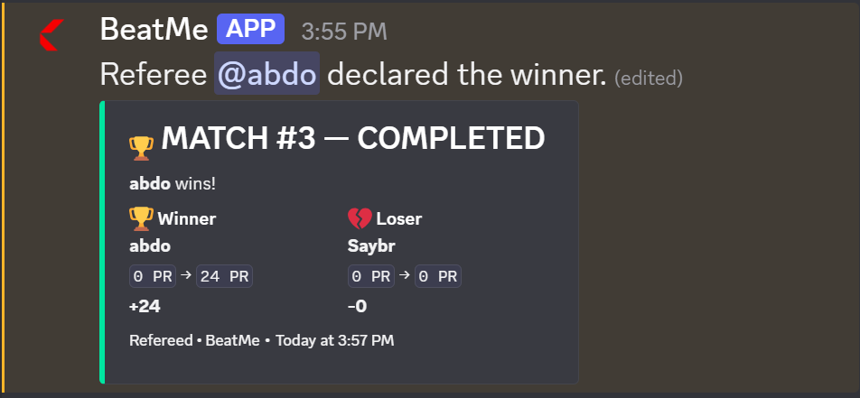

<div align="center">

<table> <tr> <td align="right" valign="middle">  </td> <td align="left" valign="middle"> <h1>BeatMe</h1> </td> </tr> </table>
### Competitive Valorant Matchmaking for Discord Communities

**Challenge. Compete. Climb.**

[](https://nextjs.org/)
[](https://www.typescriptlang.org/)
[](https://discord.js.org/)
[](https://www.prisma.io/)
[](https://www.postgresql.org/)

[Overview](#-overview) • [Screenshots](#-screenshots) • [Architecture](#-architecture) • [Tech Stack](#-tech-stack) • [Getting Started](#-getting-started) • [Roadmap](#-roadmap)

</div>

---

## Overview

**BeatMe** is a competitive matchmaking platform for Valorant communities built on Discord. It combines a **public leaderboard website** with a **Discord bot** that manages 1v1 challenges, refereeing, and Elo-based ranking.

The platform replaces manual matchmaking chaos with a structured, anti-cheat system that rewards skill and consistency.

### Key Features

- **Discord-Native Matchmaking** — Challenge opponents directly with `/play`
- **Elo-Based Ranking** — Fair rating system that adapts to player experience
- **Anti-Cheat Rules** — Rate limits, cooldowns, and opponent restrictions
- **Referee System** — Trusted members declare winners via interactive buttons
- **Verified Accounts** — Discord OAuth + Valorant account linking
- **Public Leaderboard** — Live rankings, player profiles, match history
- **Real-Time Match Channels** — Auto-created temporary channels per match
- **Modern Web Stack** — Next.js 14 Server Components + PostgreSQL

---

## 📸 Screenshots

### Website

<table>
  <tr>
    <td width="50%">
      
      <p align="center"><b>Home page</b></p>
    </td>
    <td width="50%">
      
      <p align="center"><b>Global Leaderboard</b></p>
    </td>
  </tr>
  <tr>
    <td width="50%">
      
      <p align="center"><b>Account Settings</b></p>
    </td>
    <td width="50%">
      
      <p align="center"><b>Valorant Account Linking</b></p>
    </td>
  </tr>
  <tr>
    <td width="50%">
      
      <p align="center"><b>login with discord</b></p>
    </td>
    <td width="50%">
      
      <p align="center"><b>Player Profile</b></p>
    </td>
  </tr>
</table>

### Discord Bot

<table>
  <tr>
    <td width="50%">
      
      <p align="center"><b>/play — Challenge a player</b></p>
    </td>
    <td width="50%">
      
      <p align="center"><b>Challenge acceptance</b></p>
    </td>
  </tr>
  <tr>
    <td width="50%">
      
      <p align="center"><b>Auto-created match channel</b></p>
    </td>
    <td width="50%">
      
      <p align="center"><b>Referee declares winner</b></p>
    </td>
  </tr>
</table>

---

## Architecture
```
┌──────────────────────┐ ┌──────────────────────┐
│ Discord Server │ │ Web Browser │
│ (players, refs) │ │ (visitors, users) │
└──────────┬───────────┘ └──────────┬───────────┘
│ │
│ Slash Commands │ HTTP
│ Button Interactions │ (OAuth, API)
▼ ▼
┌──────────────────────┐ ┌──────────────────────┐
│ BeatMe Bot │ │ BeatMe Website │
│ (Discord.js v14) │ │ (Next.js 14) │
│ - /play │ │ - Leaderboard │
│ - Match channels │ │ - Profiles │
│ - Elo engine │ │ - Account settings │
│ - Anti-cheat │ │ - Valorant linking │
└──────────┬───────────┘ └──────────┬───────────┘
│ │
│ Prisma ORM │
└───────────┬───────────────────┘
▼
┌──────────────────┐
│ PostgreSQL │
│ (Neon Cloud) │
│ Shared DB │
└──────────────────┘
```

**Repositories:**

<table>
    <thead>
        <tr>
            <th>Folder</th>
            <th>Description</th>
        </tr>
    </thead>
    <tbody>
        <tr>
            <td><a href="./BeatMe-Front"><code>BeatMe-Front/</code></a></td>
            <td>Next.js 14 web application — leaderboard, profiles, OAuth, account linking</td>
        </tr>
        <tr>
            <td><a href="./BeatMe-Bot"><code>BeatMe-Bot/</code></a></td>
            <td>Discord bot — matchmaking, Elo, refereeing, match channels</td>
        </tr>
    </tbody>
</table>

Both projects **share the same PostgreSQL database** via a unified Prisma schema.

---

## Tech Stack 

<table>
    <thead>
        <tr>
            <th>Layer</th>
            <th>Technologies</th>
        </tr>
    </thead>
    <tbody>
        <tr>
            <td><strong>Frontend</strong></td>
            <td>Next.js 14 (App Router), React 18, TypeScript, Tailwind CSS, MUI</td>
        </tr>
        <tr>
            <td><strong>Backend</strong></td>
            <td>Next.js API Routes, Server Actions</td>
        </tr>
        <tr>
            <td><strong>Bot</strong></td>
            <td>Discord.js v14, TypeScript, Node.js 22</td>
        </tr>
        <tr>
            <td><strong>Database</strong></td>
            <td>PostgreSQL 16 (Neon), Prisma ORM 6</td>
        </tr>
        <tr>
            <td><strong>Auth</strong></td>
            <td>Discord OAuth2, JWT (jose), HttpOnly Cookies</td>
        </tr>
        <tr>
            <td><strong>External APIs</strong></td>
            <td>Discord API v10, Henrik's Valorant API</td>
        </tr>
        <tr>
            <td><strong>Tooling</strong></td>
            <td>tsx, ESLint, Git</td>
        </tr>
    </tbody>
</table>

---

## Getting Started

### Prerequisites
- **Node.js** ```v18+ (v22 recommended)```
- **PostgreSQL** database (or free [Neon](https://neon.tech) account)
- **Discord Application** with a bot ([Developer Portal](https://discord.com/developers/applications))

### 1. Clone the repository

```
git clone https://github.com/yourusername/BeatMe.git
cd BeatMe
2. Setup the Frontend
bash
cd BeatMe-Front
npm install
cp .env.example .env
# Edit .env with your credentials
npx prisma migrate deploy
npx prisma generate
npm run dev
3. Setup the Bot
bash
cd ../BeatMe-Bot
npm install
cp .env.example .env
# Edit .env with the SAME DATABASE_URL and Discord credentials
npx prisma generate
npm run deploy   # register slash commands
npm run dev
The frontend runs on http://localhost:3000 and the bot connects to your Discord server.
```

Detailed setup instructions:

[Frontend README →](../BeatMe-Front)

[Bot README →](..BeatMe-Bot)

How It Works
For Players
Sign up on the website via Discord OAuth

Link your Valorant account

Join the Discord server

Challenge opponents with /play @user

Compete — a referee confirms the winner

Climb the global leaderboard

Elo Rating System
BeatMe uses a dynamic K-factor Elo system adapted for early-stage communities:

<table>
    <thead>
        <tr>
            <th>Player Stage</th>
            <th>Matches Played</th>
            <th>K-Factor</th>
            <th>Max Change</th>
        </tr>
    </thead>
    <tbody>
        <tr>
            <td>🟢 Placement</td>
            <td>0–9</td>
            <td>48</td>
            <td>±60</td>
        </tr>
        <tr>
            <td>🟡 Calibration</td>
            <td>10–29</td>
            <td>32</td>
            <td>±40</td>
        </tr>
        <tr>
            <td>🔴 Established</td>
            <td>30+</td>
            <td>20</td>
            <td>±25</td>
        </tr>
    </tbody>
</table>

<p>New players climb quickly to find their true skill level.</p>

Veterans have stable ratings

Upsets are rewarded heavily (beating a stronger opponent)

Ratings never drop below 0

Anti-Cheat Rules
```
Max 3 challenges sent per hour

Max 10 challenges received per hour

Max 2 matches vs the same opponent per day

1-hour cooldown after a decline

Challenges auto-expire after 5 minutes
```

Project Structure
```
text
BeatMe/
├── BeatMe-Front/              # Next.js web application
│   ├── src/
│   │   ├── app/              # App Router pages & API routes
│   │   ├── components/       # React components
│   │   ├── lib/              # Prisma, JWT, Discord helpers
│   │   └── types/            # Shared TypeScript types
│   ├── prisma/
│   │   └── schema.prisma     # Database schema
│   └── README.md
│
├── BeatMe-Bot/                # Discord bot
│   ├── src/
│   │   ├── commands/         # Slash commands
│   │   ├── interactions/     # Button handlers
│   │   ├── services/         # Elo, anti-cheat, match logic
│   │   ├── ui/               # Embed builders
│   │   └── tasks/            # Background jobs
│   ├── prisma/
│   │   └── schema.prisma     # (same as frontend)
│   └── README.md
│
└── README.md                  # This file
```

Roadmap :
```
☑ Discord OAuth login
☑ Valorant account linking
☑ Public leaderboard
☑ Player profile pages
☑ /play challenge system
☑ Auto-created match channels
☑ Referee winner declaration
☑ Elo rating system with dynamic K
☑ Anti-cheat rules
□ Challenge expiry (5 min timeout)
□ Deployment (Vercel + Fly.io)
□ Match history command
□ Rank-based challenge restrictions
□ Seasonal leaderboards
□ Tournament mode
```
🤝 Contributing
Contributions are welcome! Please:

Fork the repository

Create a feature branch (git checkout -b feature/amazing-feature)

Commit your changes (git commit -m 'Add amazing feature')

Push to the branch (git push origin feature/amazing-feature)

Open a Pull Request

License
No open-source license is specified in this README.

Author:
Abdo — Full-Stack Developer

GitHub: @AbdelBeni

Discord: https://discord.gg/StP5xMvfJ

<div align="center">
⭐ If you find this project useful, please consider giving it a star! ⭐

Made with ❤️ for the Valorant community

</div>
